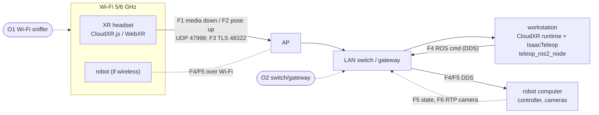

# Topology (Stage 1)

```mermaid
flowchart LR
  subgraph WiFi["Wi-Fi 5/6 GHz"]
    H["XR headset<br/>CloudXR.js / WebXR"]
    RW["robot (if wireless)"]
  end
  AP["AP"]
  SW["LAN switch / gateway"]
  WS["workstation<br/>CloudXR runtime + IsaacTeleop<br/>teleop_ros2_node"]
  RB["robot computer<br/>controller, cameras"]
  H -- "F1 media down / F2 pose up<br/>UDP 47998; F3 TLS 48322" --> AP
  AP --> SW
  SW --> WS
  WS -- "F4 ROS cmd (DDS)" --> SW
  SW -- "F4/F5 DDS" --> RB
  RB -. "F5 state, F6 RTP camera" .-> SW
  RW -. "F4/F5 over Wi-Fi" .- AP
  O1(["O1 Wi-Fi sniffer"]) -.-> WiFi
  O2(["O2 switch/gateway"]) -.-> SW
```

Lab testbed S2 differs: headset → Wi-Fi → desktop; desktop → **dedicated cable** → Raspberry Pi. No single
network observer sees both.
