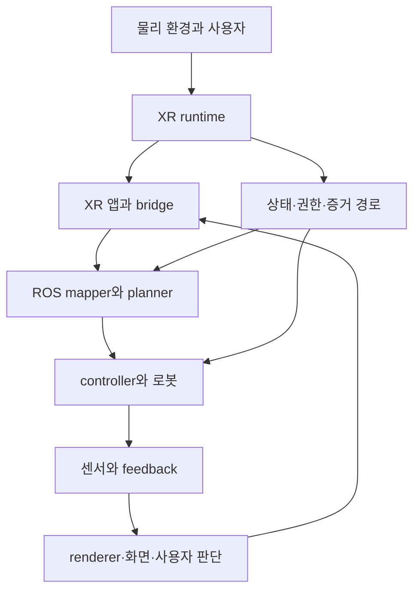

# XR→ROS 보안 연구 blueprint v1.0

이 문서의 단계별 계획은 중장기 탐색 방향이다. 실제 수행 범위는 회차별 별도 프롬프트에서 정해진다.

작성일: 2026-10-02. 기존 연구 기준점: `eff464c9b1011a7646ec80e18f4e771028b89cc5`.

## 1. 이번에 정한 전체 방향

**XR로 로봇을 조작하는 전체 왕복 경로에서, 어떤 조건이 실제로 보호되고 어떤 조건이 경계를 넘으며 사라지는지 조사한다. 각 사례의 기존 해법과 남는 한계를 검증해 matrix를 채우고, 여러 사례에 공통으로 필요한 구조가 확인되면 시스템으로 만든다.**

따라서 연구의 질문은 “독립 runtime gate를 반드시 성공시키자”로 고정하지 않는다. 입력, 상태 전환, 시간과 공간, 권한과 실행, 피드백과 승인, 개인정보와 가용성을 함께 지도에 둔다. 그렇다고 40개 사례에 한꺼번에 실험 시스템을 만들지는 않는다. 각 사례를 같은 기록 규칙으로 비교하고, 정보·신뢰 경계·집행 위치가 겹치는 사례부터 깊게 조사한다.

이번 산출물은 문헌에 근거한 **탐색 blueprint와 연구 DB의 첫 버전**이다. 확정된 SoK 논문이나 전 영역의 완료된 실험 보고서는 아니다. 이번 작성 과정에서 새로운 runtime·headset·robot 실험을 실행하지 않았다. 핵심 자료는 원문 초록 또는 관련 절을 확인했으며, `SECTION_READ`는 전문 전체 정독을 뜻하지 않는다.

| 산출물 | 내용 | 현재 규모 |
|---|---|---:|
| Taxonomy | 기존 11범주 + privacy·availability·XR UI·증거 신뢰 | 15범주 |
| Data flows | 명령·실행·feedback·승인·증거·자료 공유의 경계 | 11개 경로 |
| Cases | 기존 M1–M15와 추가 M16–M40 탐색 질문 | 40건 |
| Defenses | 인증, 검사, 계약, 집행, 감사 등 기존 방법 계열 | 14개 |
| Matrix | 관련 있는 사례–방어 pair의 초기 검토 기록 | 99행 |
| Sources | 외부 자료 36건 + pinned 내부 문서 6건 | 42건 |
| Limitations | 저자 한계·가정·후속 과제와 우리 결과의 제한 | 43건 |
| Seed inventory | 기존 문헌 목록 계승; 전부 새 검증한 것은 아님 | 94행 |

99행은 99개 실험 성공/실패 결과를 의미하지 않는다. 많은 행이 원리 검토 또는 앞으로 비교할 항목이다. 각각의 `execution_evidence`, `implemented_in_target`, `cost`를 독립적으로 읽어야 한다.

## 2. 우리가 보는 시스템의 범위

그림은 하나의 보편적인 실제 구현을 주장하는 것이 아니라 비교를 위한 논리 구조다. 어떤 앱은 화면 feedback이 없고, 어떤 시스템은 웹 브라우저 또는 원격 PC가 사이에 있다. 실제 구현을 기록할 때는 transport와 host, process, credentials, source clock을 따로 써야 한다.

| 경로 | 우리가 확인하는 질문 | 대표 사례 |
|---|---|---|
| 물리 환경 → runtime → 입력 | pose가 tracked인가? 가림·메뉴·장치 교체를 어떻게 구별하는가? | M1, M2, M27, M28 |
| 앱 → bridge → ROS | sample, arm, permission, epoch, stamp가 보존되는가? | M4, M6, M8, M9, M12 |
| mapper → controller → 물리 움직임 | 새 명령 차단이 실행 중 목표도 중단하는가? 안전한 재개는 무엇인가? | M3, M5, M11, M39 |
| robot → feedback → 화면 | 실제 상태, 전송 상태, 렌더 상태, 표시 상태가 같은가? | M22, M25, M26 |
| 화면 → 사용자 승인 → goal | 누른 대상이 실행되는 대상인가? 유효한 click이 곧 유효한 승인을 뜻하는가? | M21, M23, M24 |
| 별도 상태·증거 경로 | 누가 증거를 만들고 바꿀 수 있는가? 어느 command와 연결되는가? | M17–M20, M33, M40 |
| telemetry·로그 → 다른 주체 | 불필요한 환경·동작 자료가 유출되는가? 감사 로그를 믿을 수 있는가? | M30–M34 |

Open-TeleVision은 stereo video와 active perception 경로를, Open Teach는 hand tracking과 robot retargeting 경로를 보여 주는 시스템 출처다. Quest2ROS2는 relative mapping, pause/reset, 양손 배치, 버튼 우선순위의 실제 사례를 제공한다. 이 논문들이 보안 결함을 모두 실험했다는 뜻은 아니다. [L28–L30]

## 3. 전체 taxonomy와 확장 이유

범주는 서로 배타적이지 않다. 예컨대 캐시된 deadman은 입력 비활성(T2), 허가(T3), 시간(T4)에 동시에 걸린다. 하나의 원인을 여러 행에 복제해 독립 발견 수를 부풀리지 않도록 case ID와 원인 관계를 유지한다.

| ID | 범주 | 핵심 보호 조건 |
|---|---|---|
| T1 | Tracking | 사용한 pose의 유효성·추적 상태를 구분 |
| T2 | Session / lifecycle / action | 작업에서 요구한 입력 활성 조건 유지 |
| T3 | Permission / stop / resume | 현재 허가, 중단 반응, 재개 조건 연결 |
| T4 | Time / order / causality | 입력 시각·순서·버전·중복 관계 보존 |
| T5 | Space / anchor / calibration | 입력과 변환의 호환 구간 및 보정 정확성 |
| T6 | Input–device–arm binding | 어떤 장치의 어떤 입력으로 어느 arm을 움직였는지 |
| T7 | Ownership | 목표·취소·handoff가 현재 소유권 범위 안인지 |
| T8 | Mode / arbitration | relative/absolute·override·script의 올바른 해석 |
| T9 | Feedback / displayed state | 판단의 근거인 상태와 실행의 관계 |
| T10 | Multi-input relations | 양손·head/hand·pose/rate가 작업상 호환되는지 |
| T11 | Enforcement health | 검사·집행 고장 시 정한 반응과 recovery |
| T12 추가 | Confidentiality / inference | 환경·동작·traffic 자료의 최소 공개 |
| T13 추가 | Availability | flood·queue·runtime 장애·중단 악용의 영향 |
| T14 추가 | XR perception / UI / approval | 보인 대상·실제 선택·명령 의미의 관계 |
| T15 추가 | Evidence origin / TCB / mediation | 증거·주체 연결의 신뢰와 집행 우회 방지 |

T1–T11은 기존 저장소의 분류를 계승했다. T12–T15는 VR privacy SoK, MR deception SoK, ROS threat model, ROS/DDS 분석, XR UI·provenance 연구를 연결하며 추가했다. 이 네 범주가 새로운 taxonomy 개념이라고 주장하지 않는다. XR→ROS 왕복 경로에 적용하기 위한 작업 분류다. [L04–L18, I01]

출처에서 범주를 도출할 때는 다음 coverage checklist를 별도로 완성한다.

- OpenXR: session 상태, action 활성/변경, location flags, reference-space change, interaction profile, 시간 변환과 해당 API 버전.
- ROS: topic/service/action, lifecycle, QoS queue/durability, tf2 static/dynamic, mapper mode, controller goal/hold/cancel, watchdog.
- XR interface: rendering, displayed feedback, selection/approval, synthetic input, 가상 객체·실제 공간 관계.
- 흐름 공유: motion·camera·mesh·video·force·logs의 수집 주체, 목적지, 권한, 필요한 기능.

v1.0은 이 유한한 목록 전체를 코드 수준으로 완료했다고 주장하지 않는다. 각 item에 `사양에 존재 → SDK 제공 → 앱이 읽음 → wire 전달 → ROS 소비 → 집행`을 붙이고, 목록에 없던 구현 사례를 발견하면 범주를 추가한다. 분류 작성에 쓰지 않은 holdout 구현 최소 하나를 적용해 누락을 확인한다.

## 4. 문헌으로 확장된 탐색 방향

| 문헌 / 계열 | blueprint에서 가져오는 것 | 그대로 가져올 수 없는 주장 |
|---|---|---|
| SoK: Come Together | 공격이 정보·perception·attention·판단에 미치는 경로 | 이론적 모델이 ROS robot 피해를 이미 입증했다는 주장 |
| SoK: Data Privacy in VR | 데이터와 공격자·보호 모델, motion 및 closed-platform 문제 | 2024년의 open question이 2026년에도 그대로 남았다는 판단 |
| Humanoid Ecosystem SoK | 계층·공격×방어와 baseline/실제 배치의 구분 | 추정 점수를 실제 XR→ROS 차단율로 사용 |
| Human Joystick / Shadowed Realities | 공간·UI 기만 및 입력 출처 문제 | 다른 runtime·robot 작업에 공격이 자동 성립한다는 주장 |
| REALITYCHECK / OVRseen | provenance와 실제 dataflow를 추출하는 감사 방법 | 사후 감사가 피해 전 집행을 제공한다는 주장 |
| Erebus / Privaros | 세밀한 데이터 접근·OS/ROS 경로 강제·trusted component | 데이터가 특정 경로를 지났다는 사실로 내용의 진실성 증명 |
| Secure ROS2 / DDS 보고서 | hop별 protocol·권한·발견·노출 문제 | 과거 버전 취약성을 현재 설치 버전의 새 취약성으로 취급 |
| RTron / RIPS | graph interaction, 정책 배치, 보안과 안전 대응 | taxonomy→framework 구조 자체를 처음 제안했다는 주장 |
| ROSMonitoring / RCL / FRET–Ogma | 범용 검사·계약·요구→monitor의 강한 비교 기준 | 새 metadata envelope나 계약 언어만으로 신규성 주장 |
| Safe-ROS / JTC | 독립 감독과 실행 중 목표·정지의 분리 | 내부 논리 검증으로 전체 물리 시스템 안전 보장 |
| Affine FDIA / encrypted bilateral / 후속 defense | 명령·관측 공동 위조와 독립 관측의 역할 | 특정 ElGamal 공격을 TLS·AEAD 일반 실패로 확대 |
| Teleop delay survey | 오래된 지연 완화·예측·표시 baseline | 단순 오래된 화면과 overshoot를 XR 고유 기여로 재명명 |

XRobotAssist의 공통 모델·공간 동기화·mode awareness는 직접 비교할 middleware 후보로 등록했다. 본문 접근이 막혀 이번에는 publisher 검색 발췌 수준이다. 2026 motion privacy SoK도 primary 전문 검증 대기 상태다. 이 두 자료의 세부 한계를 만들어 적거나 novelty 판단의 확정 근거로 쓰지 않았다. [L34–L35]

## 5. 보안 연구로서의 위협 모델

| ID | 공격자 / 기준선 | 가능한 행위 | 핵심 구분 |
|---|---|---|---|
| S0 | 단순 고장·개발자 실수 | tracking loss, cache, 잘못된 config | 공격과 같은 결과여도 별도 기준선 |
| S1 | network 공격자 | 보이는 hop의 drop/delay/reorder; 인증 없는 hop 위조 | 키 없는 공격자에게 보호된 ciphertext 내용 위조 권한을 주지 않음 |
| S2 | 손상된 XR 앱 | 정상 send 권한으로 pose·stamp·자기 상태 생성 | 인증 성공이 입력과 command의 진실성을 증명하지 않음 |
| S3 | 근접 전환 유발자 | 가림·정상 메뉴/장치 전환 유발·링크 방해 | 접근 가능성과 실제 유발 효과를 separately 검증 |
| S4 | 다른 운영자 | 자기 계정·client로 타인의 target/goal/승인 침범 | 협업 기능에서 허용된 권한과 침범 구분 |
| S5 | 손상된 ROS 노드 | 허용된 topic/service/action·override 악용 | node 권한 범위와 controller 직접 접근 가능성 명시 |

Runtime, bridge, collector, gate, OS, controller를 한 덩어리의 “신뢰 시스템”으로 쓰지 않는다. 어느 요소가 trusted computing base인지 사례마다 명시한다. 앱과 같은 UID에서 collector를 보호했다고 가정하거나, 자기보고 PID를 authenticated identity로 쓰지 않는다. runtime/OS 자체를 공격자가 지배하는 경우에는 무엇을 독립적으로 보호할 수 있는지 별도 범위로 다룬다. [L04–L05, L18, L36, I05]

## 6. 기존 연구가 채운 부분과 남겨 놓은 부분

기존 결과는 blueprint의 첫 데이터다. “모든 조건을 기존 방어로 해결했다”나 “전체 연구가 중단됐다”로 일반화하지 않는다.

| 자료 | 채운 질문 | 아직 채우지 못한 질문 |
|---|---|---|
| S1–S5 | 정보가 있을 때 기존 검사·집행의 효과 | 모든 범주·모든 실제 앱에서의 sufficiency |
| 6개 code audit + R0 | wire에서 빠지는 의미와 실제 frozen stream·양손 오염 | closed frontend 내부·최종 closed consumer·물리 영향 |
| P1/P1b | command 차단과 controller hold 차이; action 원인·epoch 전달의 효과 | 실제 headset 전환; confound 없는 물리 stale-grip/recenter 평가 |
| P2 | old Monado build READY 원인 및 main 정상 진행 | Quest/SteamVR의 모든 동일 행동 |
| F1/F2 | 외부 runtime 상태 수집; 동일 freshness에서 interval·endpoint·ORD 분리 | 실제 앱의 sample-to-command provenance·S2 방어 |
| F3 | 하나의 실제 앱과 remote driver 종단간 연결 | 비활성 중 command가 계속 흐르는 실제 경로; 두 번째 앱; resume 보호 |

원문 대조에서 꼭 보존할 두 가지 세부 수치가 있다. F2의 5 ms interruption에서 interval 검사도 **1/18을 놓쳤다**. P1 epoch gate도 해당 경계에서 누출한 command가 있었다. 경계 ±20 ms 밖의 결과만으로 전 구간 차단을 주장하지 않는다. F3의 35 mm는 **target jump**이며 실제 EE 피해 거리로 해석할 수 없다. [I01, I03–I04]

현재의 “앱 수정 없이 독립 runtime gate” 설계는 검사할 수 있는 상태와 실제 command의 관계가 좁았고, F3에서 추가로 막은 command가 없었다. **그 설계의 확대를 보류한 것이지, protection requirement가 사라지거나 다른 blueprint 가지가 검증되어 닫힌 것은 아니다.**

특히 M39는 새 엔진을 먼저 만드는 제안이 아니다. 중단 시 permission을 끊고, 대기·실행 목표를 다루고, 실제 정지/유지를 확인하고, 다시 허가받은 뒤 현재 EE에 맞춰 anchor를 재설정하는 전체 계약을 비교하자는 질문이다. 이 계약의 각 부분에 기존 해법이 있다는 사실은 유지한다. 공통 manager가 더 적은 수정과 명세 오류로 같은 보장을 주는지는 아직 입증해야 한다.

## 7. Matrix의 판정 규칙

한 matrix 칸을 O/X 한 개로 쓰지 않는다. `case × 구현/버전 × 공격자 × policy × baseline`을 실제 평가 단위로 삼는다. v1.0의 99행에는 case–baseline 관계부터 넣었으며 implementation/version 결과는 후속 run 레코드로 확장한다.

각 pair에 다음을 독립적으로 남긴다.

1. **표현 가능성:** 필요한 정보가 있을 때 기존 방법으로 조건을 쓸 수 있는가?
2. **실제 구현:** 그 정보와 조건이 해당 버전에 실제로 전달·소비되는가?
3. **정보·신뢰:** 무엇을 누가 만들고 조작할 수 있으며 어느 command에 연결되는가?
4. **집행:** detect, drop, cancel, hold, physical reaction 중 어디까지 확인했는가?
5. **비용:** 수정 위치·정책·지연·정상 task 손실·오차단·자원 사용은 얼마인가?
6. **근거:** spec, paper, code, prior trace, surrogate, real app, real headset, physical robot을 구분한다.

`KNOWN_METHOD`는 알려진 방법이 해당 범위를 해결한다는 뜻이다. `IMPLEMENTATION_GAP`은 구현·전달 문제다. `CANDIDATE`는 남는 질문을 우선 검증한다는 뜻이며 **method gap 확정이 아니다**. `UNKNOWN`은 아직 판정할 근거가 부족하다. SROS2의 보호 목표 밖인 tracking truth는 auth 실패 X로 쓰지 않는다. 감사 도구에는 실시간 집행을 했다고 채점하지 않는다.

추가 연구 여지는 네 종류로 기록한다.

| 여지 | 확인할 내용 | 증거 없이 주장하면 안 되는 것 |
|---|---|---|
| 관측 | 믿을 지점에서 필요한 상태를 직접 얻는가? | 한 구현에서 필드가 없다고 원리적 관측 불가능 선언 |
| 신뢰 | 입력/증거의 주체가 의심 대상인가? 독립 근거가 있는가? | token·서명만으로 command derivation 전체 증명 |
| 기한 | 상태 효력→관측→전달→판정→controller 반응이 기한 안인가? | 검사기 µs만 보고 종단간 안전 판단 |
| 명세·통합 비용 | 가장 강한 per-app fix보다 수정·오류·비용을 줄이는가? | adapter가 필요한데 앱 수정 0으로 재표현 |

Method gap을 확정하려면 명확한 protection policy, 공격자 도달성, 재현, strongest baseline 검토가 필요하다. 기존 방법으로 충분하더라도 반복되는 명세·전환·매개 비용을 실증하면 시스템 기여 후보가 될 수 있다. 그 경우 기여는 “기존 도구로 불가능한 차단”이 아니라 **검증된 공통 보장과 배포·수정 비용 개선**에 맞춰 주장한다.

## 8. 해결된 사례의 limitation도 보존하는 규칙

사용자가 추가한 요구를 반영해 limitation은 case 판정과 독립된 테이블로 만들었다. 하나의 논문이 기존 해법인 동시에 여러 미해결 조건을 가질 수 있다.

| 필드 | 기록 규칙 |
|---|---|
| 발언 주체 | 저자 명시, 저자 가정/범위, 우리 추론, 우리 실험 제한, 미추출을 구분 |
| 원문 위치 | paper 판본 + section/page; 과장된 직접 인용 대신 짧은 요약 |
| 관련 사례 | 같은 한계를 여러 case와 연결; 해결 case에서도 삭제하지 않음 |
| 후속 상태 | unknown, 일부 후속 존재, 일부 해소, patched/mitigated, 현재 시험 범위에서 open |
| 후속 근거 | 논문·patch·issue URL/판본; 단순 다음 논문 존재와 동일 문제 해결을 구분 |
| 다음 질문 | 이 한계가 우리 attacker/flow/policy에서도 성립하는지 확인 |

예시:

- **ROSMonitoring 2.0:** service/order 검사 선행이지만 교착상태 검증·복잡한 의존성 평가는 후속 과제다. “서비스 검사가 없다”는 과거 문제를 재사용하지 않고, liveness 비용을 새 실험에서 확인한다. [L19, U15]
- **RCL/Vanda:** ROSMonitoring 2.0이 서비스를 지원하더라도 RCL/Vanda v4의 서비스·action 연결은 여전히 future work로 적혀 있다. 관련 기술의 발전과 해당 tool의 구현 상태는 다르다. [L19–L20, U16]
- **Affine FDIA:** 초기 논문의 nonlinear 확장·defense 과제에 후속 공격 및 2025 방어가 존재한다. 따라서 “아직 방어 없음”으로 기록하지 않는다. 같은 조건에서 무엇이 남는지 전문 대조가 필요하다. [L24–L26, U21–U22]
- **Safe-ROS:** 내부 safety 논리 검증이 perception error, message delay, actuator uncertainty를 포함하지 않는다고 저자가 명시한다. 우리 stop/resume 연구에서는 바로 이 종단간 조건을 시험할 수 있다. [L21, U18–U19]
- **DDS 취약점:** 보고서가 vendor patched/mitigated 상태를 명시한다. 오늘의 실험 버전과 patch를 확인하기 전에는 현재 gap으로 세지 않는다. [L17, U13]

논문 저자의 open question도 **그 논문 시점의 진술**이다. 오늘의 연구 공백으로 승격하려면 후속 연구, 도메인 전이, baseline, 실제 증거를 추가로 확인한다. `UNKNOWN`은 지금도 미해결이라는 확정 진술이 아니다.

## 9. 각 사례를 끝까지 조사하는 절차

40개 case는 동일한 절차를 따른다. “끝까지”는 가장 강한 기존 해법의 적용 조건과 남는 한계를 확인해 판정을 닫는다는 뜻이다. 필요 없는 물리·headset 실험을 모든 case에 강제한다는 뜻은 아니다.

1. **조건 고정:** 무엇을 보호할지, 어떤 작업에서 어떤 전환/공격을 허용할지 먼저 쓴다. focus loss=무조건 정지는 일반 규칙이 아니다. endpoint 허용(S_end)과 중간 permission lapse도 금지(S_life)를 구분한다.
2. **원문과 구현 추적:** 논문 가정·한계·후속 patch, source API, wire, mapper, 최종 consumer, 우회 경로를 찾는다. 검색에서 못 찾음과 부재를 구분한다.
3. **가장 작은 반례:** 원인을 한 곳에 지정한다. tf forge, 정상 recenter, calibration update, natural drift를 같은 “wrong transform”로 섞지 않는다.
4. **정상 대조:** 손을 가만히 둠, 빠른 정상 움직임, 짧은 tracking glitch, 합법 mode 전환, 정상 reconnect 등 유사하지만 허용되어야 할 상황을 포함한다.
5. **강한 비교:** 기존 direct fix, controller fix, 표준 monitor/contract, 이미 있는 app 기능을 올바르게 구성한다. 모든 arm의 정보, freshness, queue, clock, 허용 policy를 같게 한다.
6. **종단간 연결:** sample/command ID와 S/G/P/R, 상태 효력 시각, gate decision, controller goal/ack, EE/force 반응을 연결한다. 재전송된 값의 새 stamp를 새 sample 증거로 세지 않는다.
7. **경계·실패·비용:** transition boundary도 포함하고, lag/outage/crash/bypass를 평가한다. confound가 있으면 해당 outcome은 `NOT_INTERPRETABLE`로 남긴다.
8. **판정과 보존:** 알려진 방법, 구현 문제, 통합 비용 후보, 관측·신뢰·기한 후보, blocked environment, unknown을 구분한다. solved여도 limitation·run·negative result를 보존한다.

실행 전 protocol을 freeze하며 trial 수, 각 arm, 제외 범위, 기준, 예상 실행 시간을 적는다. 첫 pilot은 현실적 재현과 baseline 동작 확인에 한정한다. 본 실험의 반복 수와 confidence interval은 pilot 분산과 endpoint에 맞춰 정한다. 1,000개 command가 독립된 1,000개 trial이라고 통계적으로 계산하지 않는다.

모든 case가 가져야 할 최소 산출물은 `case card + source/limitation links + implementation trace + baseline manifest + protocol + run/evidence + scoped decision + reopen condition`이다. 환경이 막히면 원인과 현실적인 다음 접근을 남기며, “gap 없음”으로 채점하지 않는다. 두 번의 조사 cycle 뒤에도 대상·증거를 확보하지 못하면 `BLOCKED_ENV` 또는 `UNKNOWN`으로 대기시키고 다른 case를 진행한다.

## 10. 큰 연구 계획과 첫 실행 묶음

기간은 연구 규모를 정하기 위한 계획이다. 자동 실행 일정이나 완료 보장이 아니다. 모든 case의 `next_step`와 priority는 Excel Cases에 들어 있다.

| 단계 | 작업 | 산출물 / 다음 단계 조건 |
|---|---|---|
| 현재 v1.0 | 문헌·흐름·범주·case·baseline·limitations 연결 | 이 blueprint와 DB. 정독/coverage 완료 항목과 대기 항목을 분리 |
| 다음 1주 | spec/state checklist와 실제 구현 trace 보강, holdout audit | 정보가 어디에서 존재·소실·불신되는지 구현별 표 |
| 다음 2–3주 | 아래 A/B/C 묶음에서 작은 반례와 strongest baseline | 원인·정상 control·경계 포함 결과; blocked는 별도 |
| 다음 3–4주 | 공간/장치/통신/privacy subtrack 병행 | 기존 해법·실제 전달·배치 비용으로 matrix 확대 |
| 다음 4–6주 조건부 | 공통 요건이 남은 case로 최소 시스템 구성 | 실제 이질적 경로 2개 이상과 holdout case 평가; 비용·오차단·집행 효과 비교 |

### A. 상태 전환과 실제 중단·재개

M2/M3/M4/M5/M6/M39를 묶는다. 실제 명령이 interruption 중 계속 흐르는 경로를 우선 확보하고, 실패하면 이미 작동한 UR5e 경로의 resume 계약을 별도 평가한다. app/controller의 가장 강한 개별 수정을 먼저 구현한다. 공통 transition manager가 같은 증거로 그 수정들을 재사용할 수 있는지 비교한다.

핵심 측정은 target jump와 실제 EE 이동을 분리한 거리·기한, permission 재허가, anchor/controller 상태, 정상 작업 지연, 원인별 오차단, 수정 파일·위치·line 규모, 정책 중복이다. singularity 정지에 가려지지 않는 초기 자세와 task를 선택해야 물리 outcome을 해석할 수 있다.

### B. 시간·증거 출처·집행 경계

M12/M17/M18/M19/M20/M40를 묶는다. S/G/P/R과 clock 변환을 먼저 추적한다. “runtime state를 앱 밖에서 읽었다”와 “command가 허용된 sample에서 생성됐다”를 나누고, direct metadata 수정·trusted mapper·runtime enforcement·bounded wait·OS/SROS2 mediation을 baseline으로 비교한다.

S2를 주장하려면 I05의 다섯 조건을 동시에 검증해야 한다. 인증 패치 하나로 끝났다고 하지 않는다. 상태 lag를 없애는 대신 bounded wait를 넣는다면, 피해 전 기한과 정상 작업의 지연·가용성 비용까지 측정한다.

### C. feedback와 XR 승인

M22/M23/M25/M26을 묶는다. 연속 손 매핑의 고전적 delay와 구분해 **화면의 물체/점을 선택하는 목표 지정형 명령**부터 시작한다. scene/object version, frame, 선택 이벤트, 생성 command, 실제 target의 관계를 trace로 남긴다.

정직한 앱의 scene-version 검사와 WebXR input-validation을 먼저 강하게 구성한다. 남는 문제가 displayed state 관측, 손상된 앱의 거짓 승인, coordinated feedback인지 확인한다. 논문의 VR/WebXR 공격이 robot 권한·데이터 경로에서 성립하는지부터 검증한다.

### D. 전체 coverage를 위한 나머지 묶음

공간·장치·다중 입력(M7–M10/M28/M29/M38)은 code와 minimal transition부터 시작한다. 통신·privacy·availability(M15/M16/M30–M32/M35/M36)는 기존 패치·권한·utility trade-off 확인을 중심으로 진행한다. privacy가 본 시스템의 control utility와 연결되지 않으면 별도 subtrack으로 유지한다. 이미 닫힌 authority/N1 과제를 근거 없이 다시 핵심 후보로 올리지 않는다.

### 시스템으로 이어갈 판단

다음 조건이 확인되면 프레임워크를 제작할 근거가 생긴다.

- 여러 독립 사례와 이질적 실제 구현에서 같은 상태·출처·집행 관계가 반복된다.
- 올바른 기존 해법을 적용해도 매번 필요한 adapter/정책/전환 연결 비용이 공통 구조로 줄어든다.
- strongest per-app fix 및 RTron/RCL/ROSMonitoring/Safe-ROS/관련 middleware와 비교해, 동일한 보장 아래 수정·오류·지연·오차단 중 명시한 지표의 이득을 보인다.
- 공통 원천이나 privilege 때문에 생기는 correlated failure와 bypass를 다루며, holdout case에서도 보장과 제한을 예측할 수 있다.

Method gap이 없더라도 이 조건은 시스템 기여로 이어질 수 있다. 반대로 조건이 성립하지 않으면 그 설계의 확대를 닫고 matrix·실태·limitation 결과를 남긴다. 연구 전체를 단일 gate의 성공 여부에 묶지 않는다. **공백이 반드시 나온다고 약속하지는 않지만, 어떤 가정과 경계 때문에 해결되거나 남는지를 충분히 설명할 수 있는 데이터가 쌓이도록 설계했다.**

## 11. DB와 저장소 운영 방법

2026-10-02 사용자 결정: 연구 진행과 context의 기준은 GitHub 저장소다. 시트는 명시적으로 요청할 때만 접근한다. 자동 읽기·쓰기·동기화하지 않는다.

README → STATUS → CONTEXT → 이 문서 순서로 읽고, 상세 근거는 `data/blueprint.json`의 cases/sources/limitations/matrix에서 ID로 찾는다. JSON이 수정하는 단일 기준이며 CSV는 `scripts/refresh_views.py`로 재생성한다. 기존 문헌 seed는 조사 backlog로, 검증한 출처와 구분한다.

기존 semantic_evidence_framework와 archive의 protocol/raw/result는 보존한다. 이 디렉터리는 eff464c 위에 추가한 조사·handoff 자료이며 새로운 runtime/headset/robot 실험은 하지 않았다. 기존 결과를 재해석하면 별도 문서에 출처 commit과 주장 변경을 기록한다.

Checkpoint는 지도/schema → 조사 묶음 → protocol freeze → 실행/raw → analysis/decision → 조건부 prototype이다. 단계마다 commit·push 후 branch/HEAD/원격 SHA/clean 상태를 기록한다. STATUS에는 완료한 일, 불확실한 일, 바로 다음 작업을 사람이 이해하기 쉬운 말로 남긴다. CONTEXT.md는 연구 배경 참고 자료이며, 이번 회차의 실행 범위·순서·완료 조건은 별도 사용자 프롬프트에서 정한다.

## 12. 조사 방법과 제한

기존 문헌 목록 94행을 출발점으로 web search 두 엔진에서 XR/ROS/SoK/attack/defense/teleop 조합을 검색하고, USENIX/PETS proceedings·저자 원문·arXiv 판본·공식 표준/문서/저장소를 따라갔다. 실제 검색식과 포함/제외 기준은 Search_Log의 15행에 있다. 논문 본문의 limitation/future work와 후속 defense/patch를 선별 대조했다.

전문을 확보하지 못한 자료는 `ABSTRACT_READ`, `SEARCH_EXCERPT`, `UNVERIFIED_LEAD`로 표시했다. 기존 94행을 모두 정독·재검증한 것으로 계산하지 않는다. 문헌 원문에 있는 공격을 실제 XR robot에서 재현한 것으로 계산하지 않는다. 저장소의 pinned 문서를 대조했지만, 이번 작성에서 전체 raw hash를 재검증하거나 기존 실험을 재실행하지 않았다.

이 방법은 재현 가능한 **scoping 조사**의 시작이다. 최종 systematic review/SoK를 주장하려면 검색 DB별 결과 수, 중복 제거, screening reasons, reviewer 간 분류 일치, 마지막 검색 날짜, 최신 판본과 full-text 판정까지 확대해야 한다. 현재 점수나 전체 안전율을 계산하지 않았으며, 미검증 칸을 실패 또는 공백으로 바꾸지 않았다.

## 부록. 출처와 사례 목록

아래 목록은 DB에서 생성한다. 각 source URL과 판본으로 원문을 다시 확인할 수 있다.

### 출처

| ID | 자료 | 확인 수준 | 원문 |
|---|---|---|---|
| L01 | OpenXR action synchronization — 1.1 / live man page | SECTION_READ | [원문](https://registry.khronos.org/OpenXR/specs/1.1/man/html/xrSyncActions.html) |
| L02 | OpenXR space location flags — 1.1 / live man page | SECTION_READ | [원문](https://registry.khronos.org/OpenXR/specs/1.1/man/html/XrSpaceLocationFlagBits.html) |
| L03 | OpenXR reference-space change event — 1.1 / live man page | SECTION_READ | [원문](https://registry.khronos.org/OpenXR/specs/1.1/man/html/XrEventDataReferenceSpaceChangePending.html) |
| L04 | ROS 2 Robotic Systems Threat Model — 2019; modified 2021 | SECTION_READ | [원문](https://design.ros2.org/articles/ros2_threat_model.html) |
| L05 | ROS 2 DDS-Security integration — 2019 design / live page | SECTION_READ | [원문](https://design.ros2.org/articles/ros2_dds_security.html) |
| L06 | SoK: Come Together — MR Deception Attack Ontology & Analysis Framework — USENIX Security 2025 | SECTION_READ | [원문](https://www.usenix.org/system/files/usenixsecurity25-teymourian.pdf) |
| L07 | SoK: Data Privacy in Virtual Reality — PoPETs 2024(1); arXiv v2 | SECTION_READ | [원문](https://arxiv.org/html/2301.05940v2) |
| L08 | SoK: Cybersecurity Assessment of Humanoid Ecosystem — arXiv 2508.17481 v2 | SECTION_READ | [원문](https://arxiv.org/html/2508.17481v2) |
| L09 | Immersive Virtual Reality Attacks and the Human Joystick — TDSC 2021; DOI 2019 | ABSTRACT_READ | [원문](https://digitalcommons.newhaven.edu/electricalcomputerengineering-facpubs/86/) |
| L10 | Shadowed Realities: An Investigation of UI Attacks in WebXR — USENIX Security 2025 | SECTION_READ | [원문](https://www.usenix.org/system/files/usenixsecurity25-mukherjee.pdf) |
| L11 | Principled and Automated Approach for Investigating AR/VR Attacks (REALITYCHECK) — USENIX Security 2025 | SECTION_READ | [원문](https://www.usenix.org/system/files/usenixsecurity25-shoaib.pdf) |
| L12 | OVRseen: Auditing Network Traffic and Privacy Policies in Oculus VR — USENIX Security 2022 | SECTION_READ | [원문](https://www.usenix.org/system/files/sec22-trimananda.pdf) |
| L13 | Erebus: Access Control for Augmented Reality Systems — USENIX Security 2023 | SECTION_READ | [원문](https://www.usenix.org/system/files/usenixsecurity23-kim-yoonsang.pdf) |
| L14 | Unique Identification of 50,000+ VR Users from Head & Hand Motion Data — USENIX Security 2023 | SECTION_READ | [원문](https://www.usenix.org/system/files/usenixsecurity23-nair-identification.pdf) |
| L15 | To Make a Robot Secure: Cyber Security Threats Against Teleoperated Surgical Robots — arXiv 1504.04339 v2 / 2015 | SECTION_READ | [원문](https://arxiv.org/pdf/1504.04339) |
| L16 | On the (In)Security of Secure ROS2 — CCS 2022 | SECTION_READ | [원문](https://geleideng.github.io/publication/ros2-security/ros2-security.pdf) |
| L17 | A Security Analysis of the Data Distribution Service (DDS) Protocol — Trend Micro et al.; 2021 disclosures | SECTION_READ | [원문](https://documents.trendmicro.com/assets/white_papers/wp-a-security-analysis-of-the-data-distribution-service-dds-protocol.pdf) |
| L18 | Risk Analysis and Policy Enforcement of Function Interactions in Robot Apps (RTron) — arXiv 2103.12365 v1 / 2021 | SECTION_READ | [원문](https://arxiv.org/html/2103.12365v1) |
| L19 | ROSMonitoring 2.0: Extending ROS RV to Services and Ordered Topics — FMAS 2024; arXiv v1 | SECTION_READ | [원문](https://arxiv.org/html/2411.14367v1) |
| L20 | A Compositional Approach to Verifying Modular Robotic Systems (RCL/Vanda) — arXiv 2208.05507 v4 / 2026 revision | SECTION_READ | [원문](https://arxiv.org/html/2208.05507v4) |
| L21 | Safe-ROS: An Architecture for Autonomous Robots in Safety-Critical Domains — FMAS 2025 / EPTCS 436 | SECTION_READ | [원문](https://arxiv.org/pdf/2511.14433) |
| L22 | Monitoring ROS2: from Requirements to Autonomous Robots (FRET/Ogma/Copilot) — FMAS 2022 / arXiv v1 | SECTION_READ | [원문](https://arxiv.org/html/2209.14030v1) |
| L23 | FlowTags: Enforcing Network-Wide Policies with Dynamic Middlebox Actions — NSDI 2014 | ABSTRACT_READ | [원문](https://www.usenix.org/conference/nsdi14/technical-sessions/presentation/fayazbakhsh) |
| L24 | Affine Transformation-based Perfectly Undetectable FDIA on Remote Manipulator Kinematic Control — arXiv 2405.11047 v1 / RA-L 2024 line | SECTION_READ | [원문](https://arxiv.org/html/2405.11047v1) |
| L25 | Perfectly Undetectable FDIA on Encrypted Bilateral Teleoperation based on Dynamic Symmetry and Malleability — arXiv 2409.13061 v1 / 2024 | SECTION_READ | [원문](https://arxiv.org/html/2409.13061v1) |
| L26 | Defense Mechanisms Against Undetectable Cyberattacks on Encrypted Telerobotic Control Systems — TMECH 2025 / DOI 10.1109/TMECH.2025.3570933 | ABSTRACT_READ | [원문](https://www.biorobotics.gatech.edu/wp/ieee-tmech-defense-mechanisms-against-undetectable-cyberattacks-on-encrypted-telerobotic-control-systems/) |
| L27 | A Brief Survey of Telerobotic Time Delay Mitigation — Frontiers Robotics and AI 2020 | SECTION_READ | [원문](https://www.frontiersin.org/journals/robotics-and-ai/articles/10.3389/frobt.2020.578805/full) |
| L28 | Open-TeleVision: Teleoperation with Immersive Active Visual Feedback — arXiv 2407.01512 v1 / 2024 | SECTION_READ | [원문](https://arxiv.org/html/2407.01512v1) |
| L29 | Open Teach: A Versatile Teleoperation System for Robotic Manipulation — arXiv 2403.07870 v1 / 2024 | SECTION_READ | [원문](https://arxiv.org/html/2403.07870v1) |
| L30 | Quest2ROS2: A ROS 2 Framework for Bi-manual VR Teleoperation — arXiv 2601.18289 v1 / 2026 | SECTION_READ | [원문](https://arxiv.org/html/2601.18289v1) |
| L31 | Joint trajectory controller documentation — ROS2 Control Jazzy / live 2026-10 | SECTION_READ | [원문](https://control.ros.org/jazzy/doc/ros2_controllers/joint_trajectory_controller/doc/userdoc.html) |
| L32 | message_filters and geometry2 official repositories — Live repositories; version must be pinned in experiments | INDEX_READ | [원문](https://github.com/ros2/message_filters) |
| L33 | Towards a Robotic Intrusion Prevention System (RIPS) — arXiv 2407.06669 / 2024 | ABSTRACT_READ | [원문](https://arxiv.org/abs/2407.06669) |
| L34 | XRobotAssist: Novel Middleware Framework for Integrating XR into Robotic Manufacturing Processes — JMMP 2026; DOI 10.3390/jmmp10020046 | SEARCH_EXCERPT | [원문](https://doi.org/10.3390/jmmp10020046) |
| L35 | SoK: Motion Data Privacy in Extended Reality — arXiv 2609.00711 / 2026 | UNVERIFIED_LEAD | [원문](https://arxiv.org/abs/2609.00711) |
| L36 | Privaros: A Framework for Privacy-Compliant Delivery Drones — CCS 2020 / author HTML | SECTION_READ | [원문](https://www.csa.iisc.ac.in/~vg/papers/ccs2020/ccs2020_html/) |
| I01 | Pinned taxonomy and matrix v0 — eff464c / 2026-10-02 | PINNED_DOC_READ | [원문](https://github.com/MPEffinc/ros-xr-semantic-validation/blob/eff464c9b1011a7646ec80e18f4e771028b89cc5/semantic_evidence_framework/docs/03_TAXONOMY_AND_MATRIX.md) |
| I02 | Pinned project status and corrected claims — eff464c / 2026-10-02 | PINNED_DOC_READ | [원문](https://github.com/MPEffinc/ros-xr-semantic-validation/blob/eff464c9b1011a7646ec80e18f4e771028b89cc5/semantic_evidence_framework/STATUS.md) |
| I03 | F2 matched comparison results — eff464c / 27 runs | PINNED_DOC_READ | [원문](https://github.com/MPEffinc/ros-xr-semantic-validation/blob/eff464c9b1011a7646ec80e18f4e771028b89cc5/semantic_evidence_framework/results/F2_RESULTS.md) |
| I04 | F3 one-real-app end-to-end results — eff464c / 6 trials | PINNED_DOC_READ | [원문](https://github.com/MPEffinc/ros-xr-semantic-validation/blob/eff464c9b1011a7646ec80e18f4e771028b89cc5/semantic_evidence_framework/results/F3_REAL_APP_RESULTS.md) |
| I05 | S2 security path design — eff464c / design only | PINNED_DOC_READ | [원문](https://github.com/MPEffinc/ros-xr-semantic-validation/blob/eff464c9b1011a7646ec80e18f4e771028b89cc5/semantic_evidence_framework/docs/07_S2_SECURITY_PATH_DESIGN.md) |
| I06 | F2 timestamp semantics review — eff464c / 7 apps | PINNED_DOC_READ | [원문](https://github.com/MPEffinc/ros-xr-semantic-validation/blob/eff464c9b1011a7646ec80e18f4e771028b89cc5/semantic_evidence_framework/results/F2_TIMESTAMP_REVIEW.md) |

### 사례별 다음 질문

| ID | 사례 | 현재 판정 | 다음 확인 |
|---|---|---|---|
| M1 | 추적되지 않는 pose의 로봇 구동 | KNOWN_METHOD | 실제 runtime 가림·복구 경로와 정상 정지 손을 분리 재현 |
| M2 | focus 상실 중 fresh-stamped 고정 pose | CANDIDATE | 계속 명령을 내는 실제 앱/런타임 경로 확보 후 평가 |
| M3 | grip 해제 뒤 잔여 이동 | KNOWN_METHOD | singularity 없는 자세·하중별 범위로 controller baseline 재검증 |
| M4 | 비활성 중 해제된 deadman의 눌림 캐시 | KNOWN_METHOD | 실제 ALVR/Quest 전제와 원인별 re-arm 오차단 확인 |
| M5 | 오래된 anchor로 재개 | KNOWN_METHOD | 기존 re-anchor+fresh press를 강한 baseline으로 두고 종단간 확인 |
| M6 | recenter의 효력 구간 혼합 | KNOWN_METHOD | 경계 포함 채점; 실제 원점 이벤트·정상 빠른 움직임 대조 |
| M7 | 오래된 입력과 latest tf 사용 | KNOWN_METHOD | 버전 pin 후 동적 tf 전환과 Time(0)/stamp 비교 |
| M8 | 왼손 topic에 오른손 메시지 내용 | IMPLEMENTATION_GAP | root fix 및 frame만 맞춘 swap 공격을 별도 비교 |
| M9 | controller 부재 시 head pose 대체 | IMPLEMENTATION_GAP | hand loss 뒤 head move와 명시적 fallback 정상 모드 비교 |
| M10 | 양팔 rate / override fan-out | IMPLEMENTATION_GAP | 한쪽 변경 시 다른 arm 불변성·동시 정상 입력 확인 |
| M11 | latched override의 deadman 우회 | KNOWN_METHOD | 사용자 선언한 scripted motion 허용 정책부터 고정 |
| M12 | 묵은 값에 새 stamp 부여 | CANDIDATE | 실제 한 앱의 sample·command 연결 측정; 수정 수용 조건 구분 |
| M13 | monitor / gate 고장 | KNOWN_METHOD | consumer 직접 우회·restart·물리 hold를 결합 확인 |
| M14 | lease / authority 전환 | KNOWN_METHOD | 새 multi-user 경로의 구체적 반례가 있을 때만 재개 |
| M15 | 인증 없는 XR bridge | KNOWN_METHOD | 모든 hop의 활성 security config와 residual DoS 확인 |
| M16 | DDS 권한·발견 구현의 우회 | UNKNOWN | vendor advisory·patch commit 대조 후 isolated regression |
| M17 | 정상 키 앱의 pose·stamp·상태 공동 위조 | CANDIDATE | 최소 trusted mapper/independent sensor baseline과 반례 설계 |
| M18 | runtime 제어 권한·client identity 사칭 | CANDIDATE | observe/control 분리 및 authenticated binding 비용 pilot |
| M19 | gate를 건너뛴 controller 직접 접근 | KNOWN_METHOD | 권한 있는 XR 앱에서 모든 downstream bypass negative test |
| M20 | 증거·제어 경로 과부하 및 fail-closed DoS | CANDIDATE | 같은 부하·freshness에서 queue/isolation baseline과 비교 |
| M21 | 다른 운영자의 승인·goal 취소 침범 | KNOWN_METHOD | 정상 handoff와 타인 goal 취소를 별도 regression |
| M22 | 본 장면의 target와 실행 target가 달라짐 | CANDIDATE | 목표 지정형 앱에서 scene version baseline 먼저 적용 |
| M23 | XR overlay / synthetic cursor로 잘못 승인 | CANDIDATE | 비인간 테스트 UI→goal linkage; input-validation baseline 재현 |
| M24 | 공간·chaperone 기만으로 operator motion 유도 | UNKNOWN | 권한·공격면 확인 후 화면 기만과 단순 좌표 forge 구분 |
| M25 | 명령·feedback의 coordinated FDI | CANDIDATE | 2025 방어 전문 대조; 똑같은 관측·공격권한으로 비교 |
| M26 | haptic / force feedback의 누락·변형 | UNKNOWN | 촉각 의존 작업 정의·delay baseline·독립 force metric |
| M27 | 물리 가림·방해로 정상 transition 유발 | UNKNOWN | hardware 경로 확보 시 benign glitch와 intentional repeated interruption 비교 |
| M28 | hand/controller/profile 교체 중 기준점 변경 | UNKNOWN | 정확한 spec event 확인→실제 구현 2개 코드→minimal transition |
| M29 | static tf / calibration 갱신과 cache의 엇갈림 | UNKNOWN | 동적 tf·고정 tf·app anchor를 구분해 버전별 재현 |
| M30 | XR camera / mesh / 공간 데이터 과다 공유 | KNOWN_METHOD | 실제 teleop flow inventory와 최소 데이터 기능 유지 비교 |
| M31 | teleop motion으로 사용자 식별 | UNKNOWN | 2026 SoK 전문·teleop 데이터·utility/privacy threat model 대조 |
| M32 | 암호화 트래픽의 작업·행동 추론 | UNKNOWN | seed 2312.06802·2026 joint attack 전문 후 동일 task 평가 |
| M33 | 닫힌 앱·runtime의 증거 미노출 | UNKNOWN | 지원 runtime별 capability manifest·closed app observe 가능성 조사 |
| M34 | 인과 로그 부족·위조로 잘못된 audit | CANDIDATE | 재현 trace에 provenance audit 적용; 실시간 방어로 채점 금지 |
| M35 | runtime IPC query로 service 가용성 상실 | UNKNOWN | upstream issue/patch 중복 확인·pin regression·recovery 평가 |
| M36 | 재연결·QoS queue에서 묵은 목표 실행 | KNOWN_METHOD | 한 hop씩 queue 주입→실제 reconnect; 정상 loss 대조 |
| M37 | 안전 범위 안이지만 잘못된 mode/작업 명령 | CANDIDATE | RTron/RCL 가장 강한 policy 구성과 동등 정보 비교 |
| M38 | 자연 drift / 보정 오차의 독립 판정 | UNKNOWN | 기존 calibration/SLAM 방어 문헌부터 추가; forge/recenter와 분리 |
| M39 | 중단→정지→재허가→재기준화의 결합 | CANDIDATE | 2개 실제 경로의 완전한 per-app fix vs 공통 manager 동일 조건 비교 |
| M40 | 짧은 transition·지연 증거의 검사 race | CANDIDATE | event delivery·bounded wait·runtime enforcement baseline 비용 비교 |
